# hsa-autoscale-groups

# Task
Create autoscale group that will contain one ondemand instance and will scale on spot instances.

Set up scaling policy based on AVG CPU usage.

Set up scaling policy based on requests amount that allows non-linear growth.

# Solution

1. Create launch template
   1. 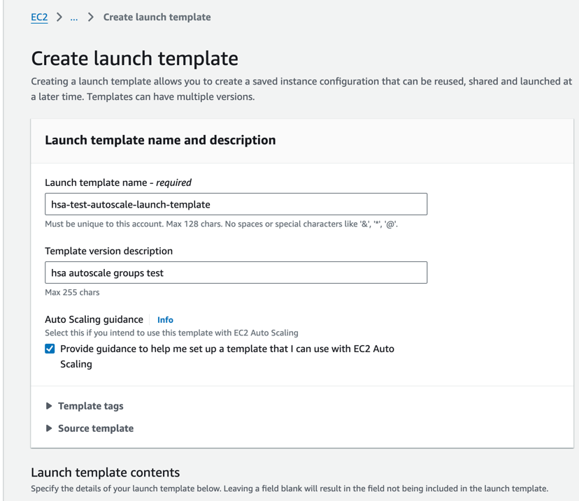
   2. 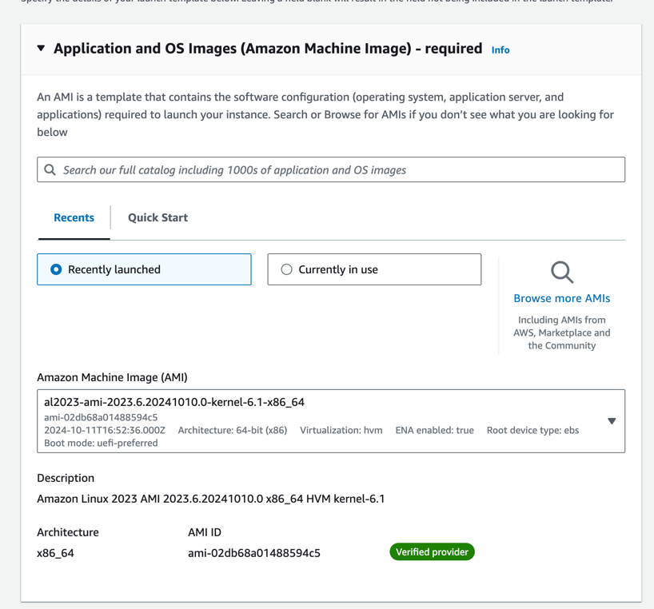
   3. 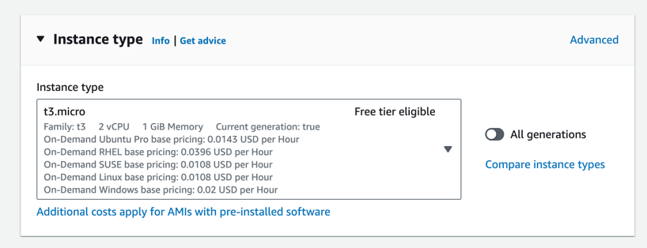
   4. 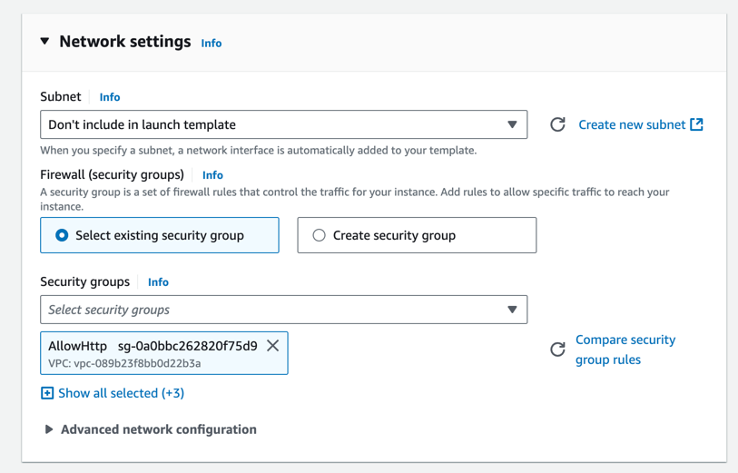
   5. Set up user data script 
      1. ```#!/bin/bash
         sudo yum update -y
         sudo yum install nginx -y
         sudo systemctl start nginx
         sudo systemctl enable nginx
         sudo mkdir -p /usr/share/nginx/html/images
         sudo wget -q "https://picsum.photos/200/300.jpg" -P /usr/share/nginx/html/images
         sudo chmod -R 755 /usr/share/nginx/html/images
         # Overwrite nginx.conf with custom configuration
         cat <<EOT > /etc/nginx/nginx.conf
         user nginx;
         worker_processes auto;
         events {
            worker_connections 1024;
         }
         
         http {
            include       mime.types;
            default_type  application/octet-stream;
            sendfile        on;
            keepalive_timeout  65;
         
            server {
                listen 80;
                server_name _;
                location /images/ {
                    alias /usr/share/nginx/html/images/;
                    autoindex on;
                }
            }
         }
         EOT
         
         # Start and enable Nginx
         systemctl start nginx
         systemctl enable nginx
         sudo systemctl reload nginx
2. Create autoscale group with ALB from previous homework
   1. 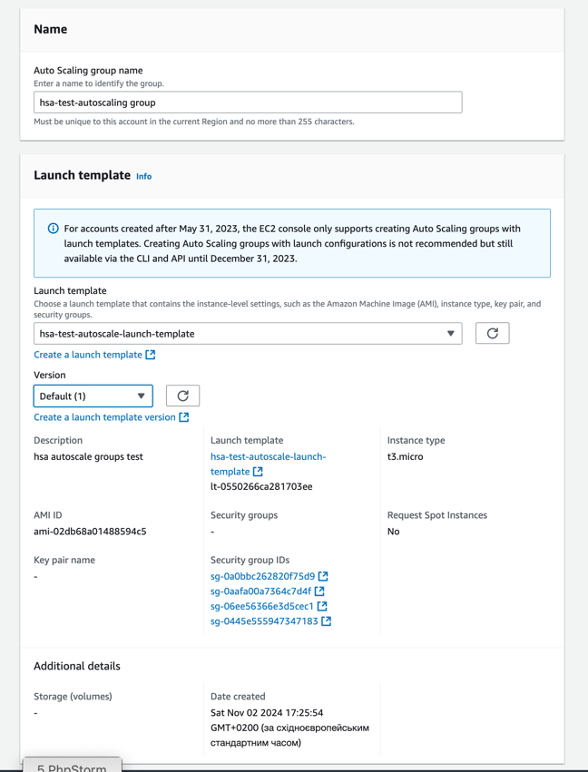
   2. 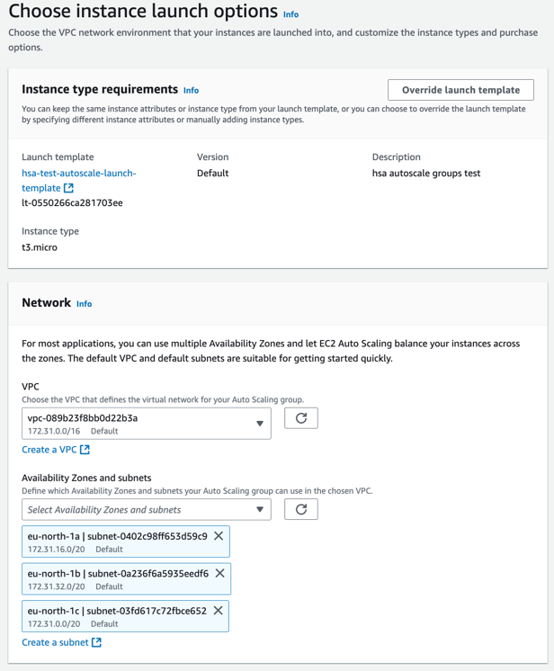
   3. 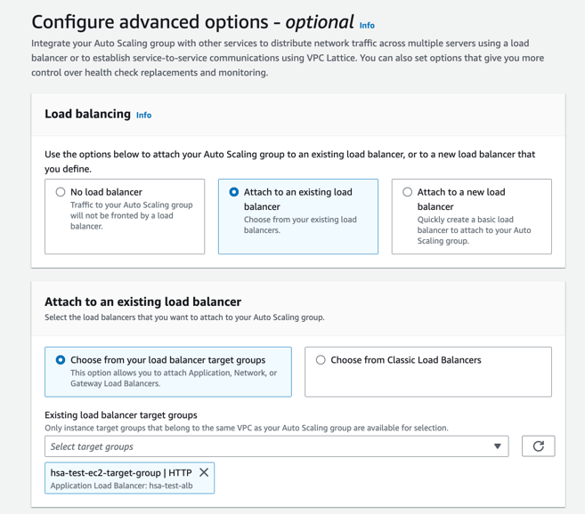
   4. 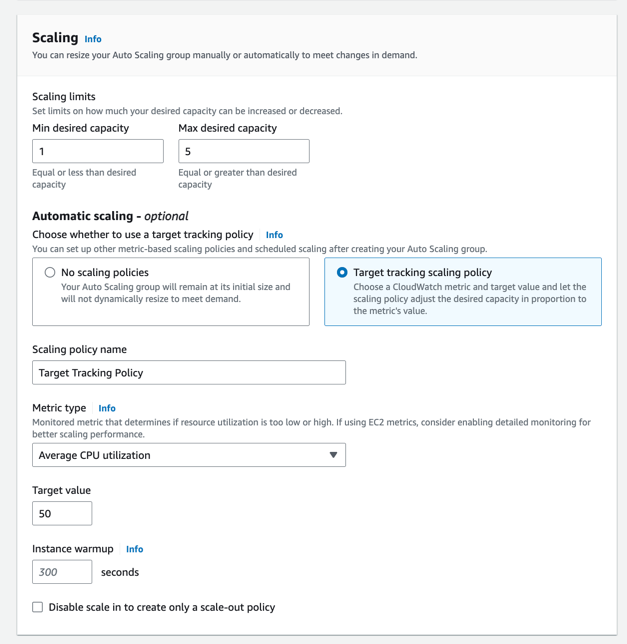
3. ALB resource map 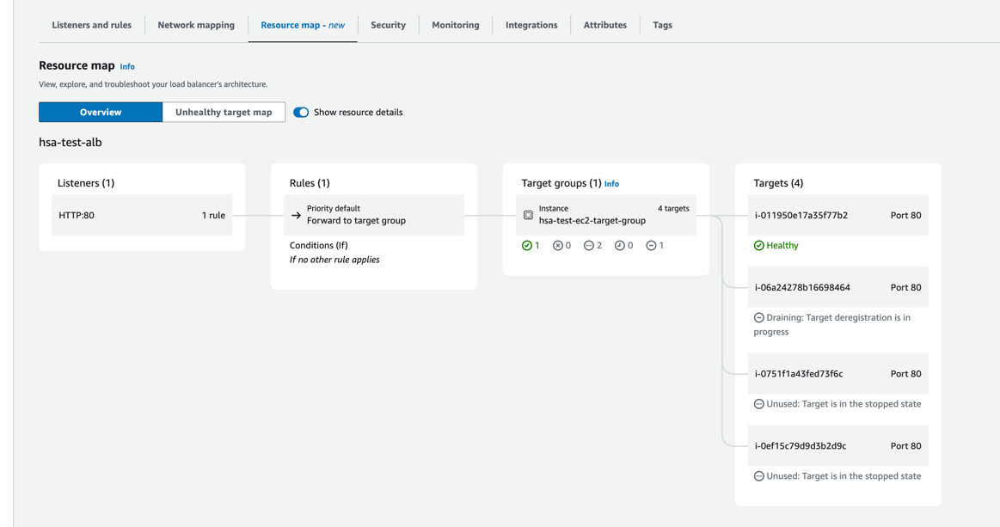
4. Scale policies 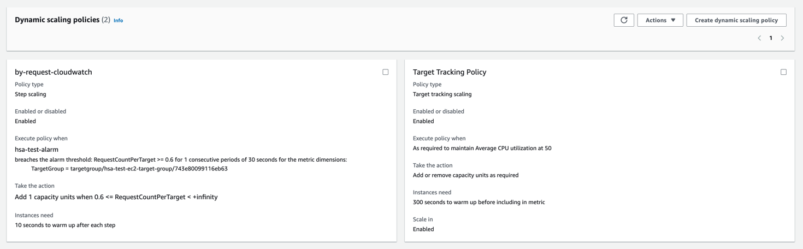
5. Test image is accessible 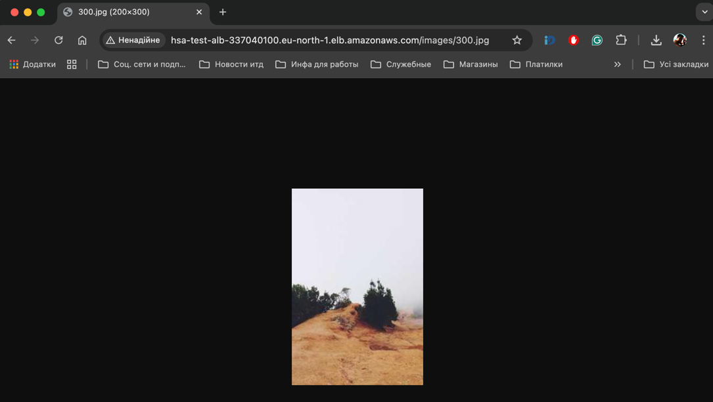
6. Testing with load
   1. Was unable to significantly load CPU metric due to lightweight logic
   2. Attempting to load with GET requests to test image via siege
      1. 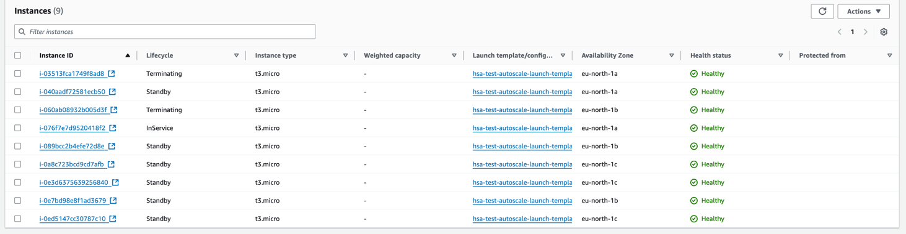
      2. 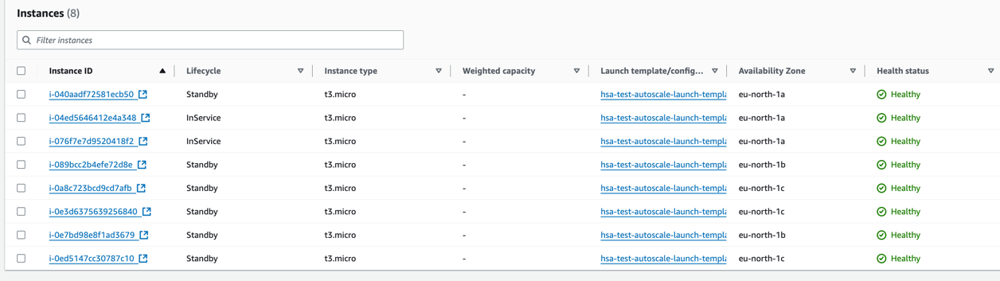
      3. 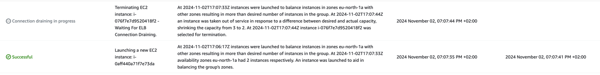 (from debug experiments there were some amount of leftover instances, so autoscaling failed several times before)